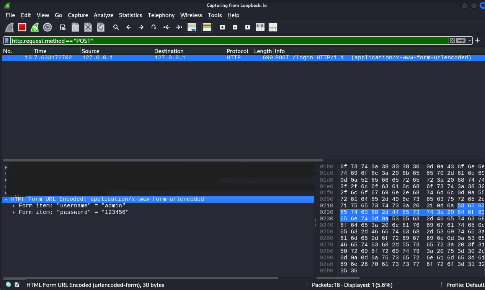
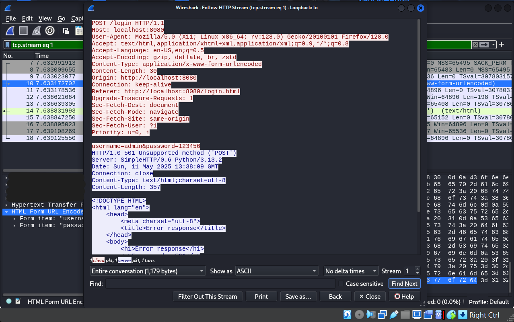

# Network Analysis Lab

Network Traffic Monitoring

## Objective

Simulated sending login data via the HTTP POST method and analyzed how data can be seen in cleartext when not using HTTPS. This project highlights the importance of using encryption in web applications.

## Skills Learned

- Web application security awareness
- Network packet analysis with Wireshark
- Local attack surface simulation
- Practice ethical hacking (without damaging the system)

## Tools Used

- Kali Linux (VM)
- Python HTTP Server (python3 -m http.server)
- Browser (Firefox)
- Wireshark
- Terminal/Shell

## Steps

<b>1. Create a folder</b>
  - Create a folder with the terminal that will contain the html files: mkdir simulasi-login
  - Enter the folder: cd simulasi-login

<b>2. Create a login form</b>
  - Create the login form inside the simulasi-login folder: nano login.html
  - Fill in the login.html file:  
    

<b>3. Run Python HTTP Server</b>  
      
  - The server will be active at: http://localhost:8080
  - Leave the terminal open (server remains active)

<b>4. Run Wireshark</b>
  - Run the Wireshark application or from the terminal type: wireshark
  - Then select the loopback interface (lo)  
    Why loopback?  
    Because the loopback interface is to capture network traffic that is internal, that is, traffic that occurs within the computer itself without involving external networks.

<b>5. Access login form from browser</b>
  - Since the web server is up, run this in the browser: http://localhost:8080/simulasi-login/login.html  
  - And the login form that has been created in the login.html file will appear.

<b>6. Entering username and password</b>
  - After the login form appears, enter the original username and password. Here I enter:  
    username: admin  
    password: 123456  
    
  - An 'Error response' will appear. Because the login form is created without validation.
    

<b>7. Capture network packets</b>
  - Capture network packets with Wireshark already running.
  - Use filters to facilitate customized searches. Here I filtered: http.request.method == “POST”  
      
    Note: The POST method on Wireshark network packets is an HTTP request method used to send data to a server such as a web form (HTML form).

### Results and Analysis

There are several ways to view the analysis results.
1. Results that can be seen immediately when clicking on the network packet and will appear below the network packet screen.
     
   The analysis:  
   In the Hypertext Transfer Protocol section, there is some information obtained:
    - 'Origin' points to hhtp://localhost:8080 which is the server.
    - 'Connection: keep-alive' indicates that the server connection is active.
    - 'Referer' refers to the login.html file on the server that is running  
    
     
   In the HTML Form URL Encoded section, there is username and password information entered on the login form in the browser.  
   
   Why can the username and password be seen in Wireshark?  
   Because by filling in the login form on HTTP in the browser, which HTTP does not have encryption, unlike HTTPS which has encryption.
   
2. Results that can be seen by right-clicking on the network packet, then selecting Follow > HTTP Stream
     
   The analysis in this image is the same as above, but in this way the information looks more complete because it is in 1 screen.  
   The analysis:  
   - The 'User-Agent' shows that the login form is accessed in the Mozilla Firefox browser.
   - Origin, Connection, and Referer are still the same as explained above.
   - It can be seen that 'username=admin&password=123456' was entered on the login form.
   - It can also be seen that this network package uses HTTP and the POST method.
   - 'Server' indicates the server used which is HTTP Server and Python.
   - There is a detailed date and time.
   - 'Connection=close' indicates the server connection has been terminated.  

So,
- It can be seen that the data is sent in cleartext over the HTTP protocol.
- No encryption protects sensitive data.
- Potential to be hacked by attackers on open/public networks.

### Advice

- Use HTTPS to access anything in the browser. Especially on the login form.
- Avoid HTTP even in a local/test environment.

## Conclusion

This simulation shows that sending login data using the unencrypted HTTP POST method (HTTP) is highly vulnerable to interception. This project reinforces the understanding of:  
- The importance of encryption in web application security
- How Wireshark is used to analyze protocol weaknesses
- The real risks of using HTTP on login forms
